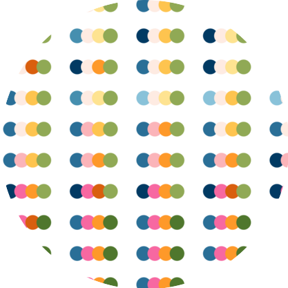

# Shandiya Balasubramaniam

This repository contains the code used to build my [personal website](https://shandiya.com) using Quarto. The image on the home page is a visual summary of the 2023 aggregated [biodiversity dataset](https://data.csiro.au/collection/csiro%3A60456v1) from the [EcoAssets project](https://ecoassets.org.au). The colours of the circles represent properties associated with extent of protected areas, number of unique species, and proportions of introduced and threatened species, and each group of four circles represents a year from 1900 to 2022. The code is [here](https://github.com/shandiya/quarto-website/blob/main/R/draw_images.R), if you're interested in reproducing or modifying it.   
