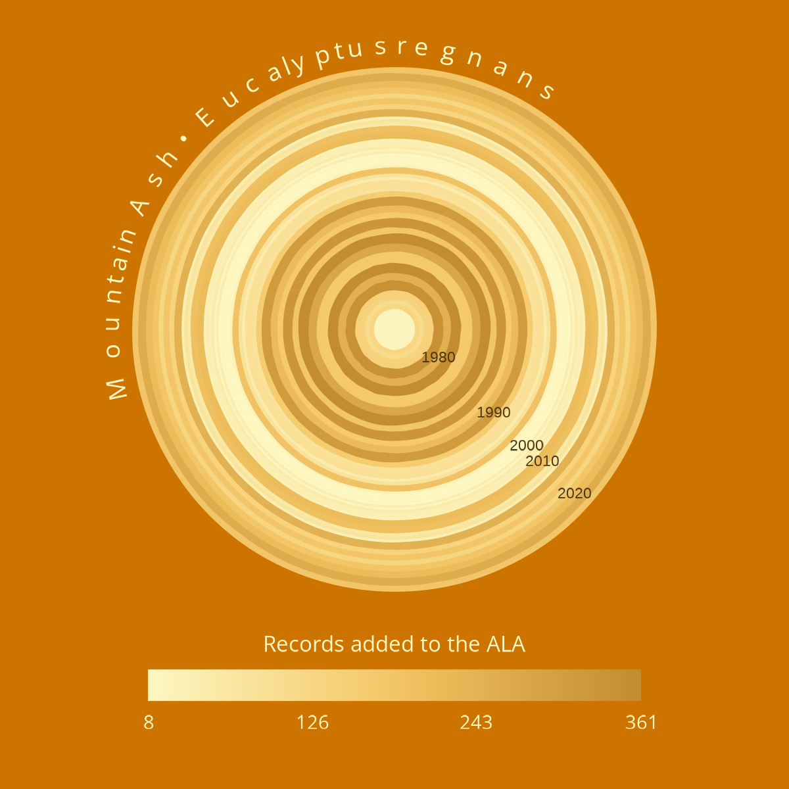
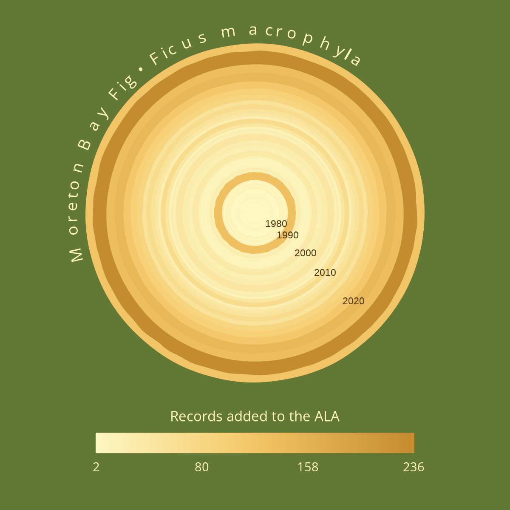
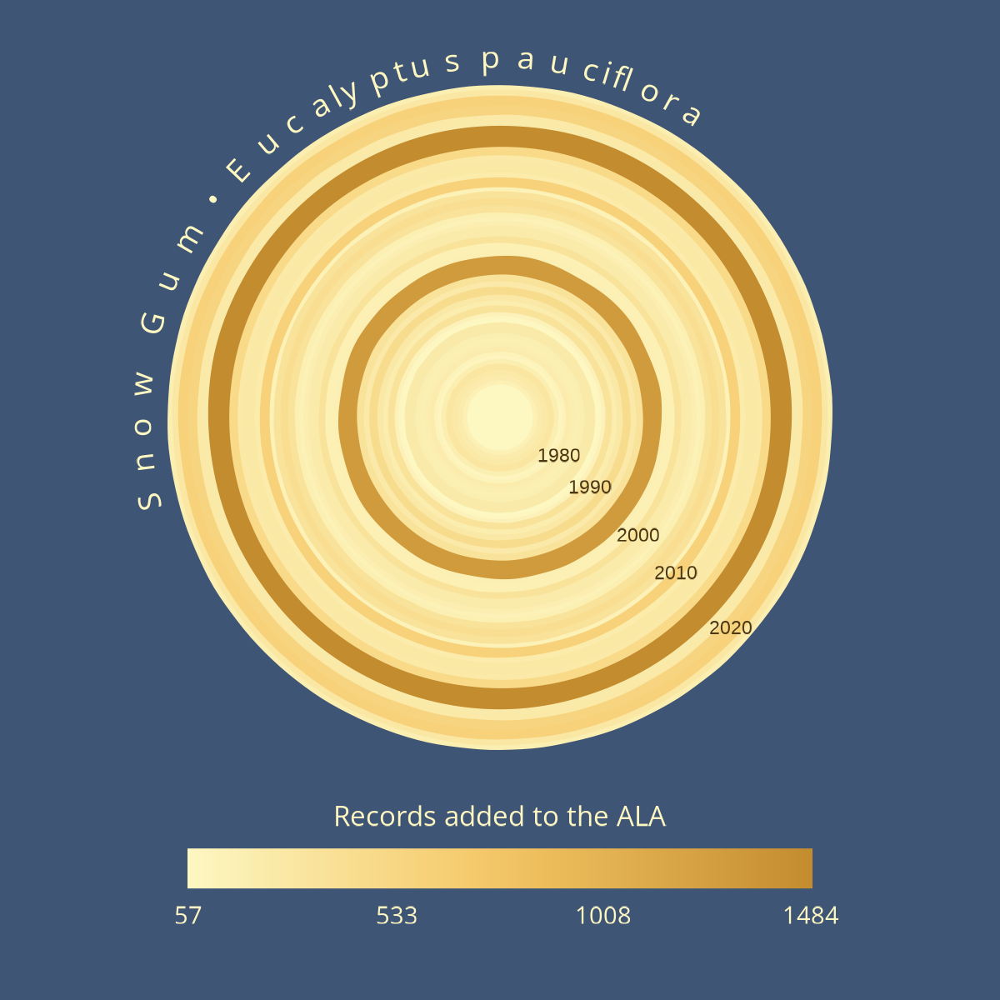
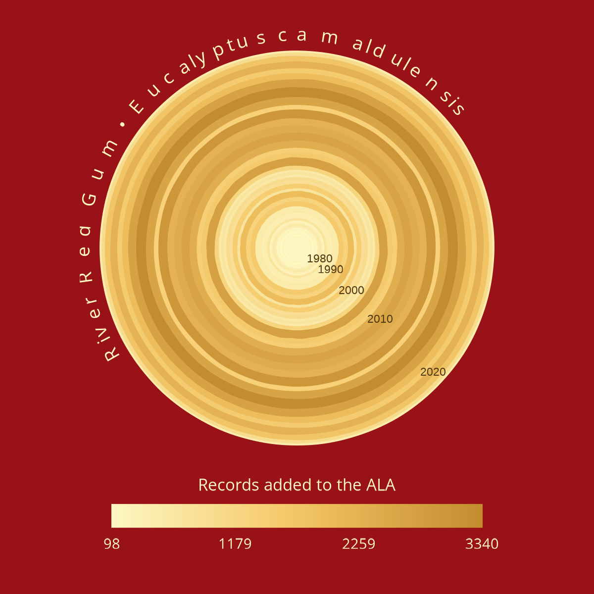
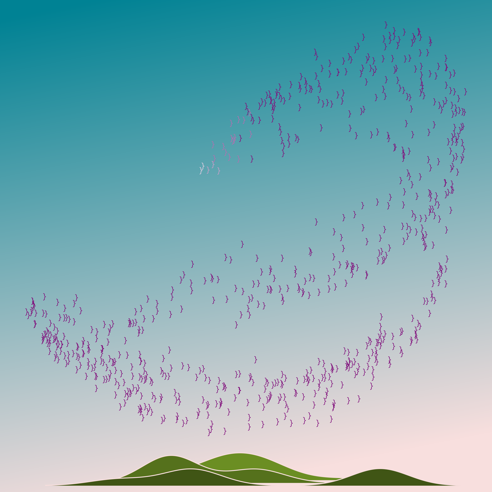

### National Eucalypt Day 2026

A hundred years' worth of eucalypt records in the Atlas of Living Australia (ALA) are summarised here (1926-2025). 

Ocean:  
Each year is ploted along the horizontal x-axis, and each eucalypt species is plotted along the vertical y-axis. There are 35 eucalypt species represented here, each of which was the most frequently recorded species during at least one of those hundred years. Every ripple in the water shows the intersection of a species with a year: multiple ripples occurring within a row indicate that species was most-observed across many years, whereas a row with only one ripple means the species was the most-observed species in only one of the hundred years. 

Stars and moon:  
The stars are plotted along the same x-axis and the y-axis represents number of records, so the positions show the relative number of records for the most-observed species in that year. The increasing upward trend towards the right of the image shows the overall increase in record numbers over the years. The crescent moon is a tiny sliver, here taking up only 5% of the area of a full circle. This represents the 5% of all plant records in the ALA that comprise eucalypt species.

Hills:  
The seven hills in the centre highlight the seven winning species of the [Eucalypt of the Year](https://eucalyptaustralia.org.au/eucalypt-of-the-year-2026/) awards: *Corymbia ficifolia*, *Angophora costata*, *Eucalyptus regnans*, *Eucalyptus salubris*, *Eucalyptus erythrocorys*, *Eucalyptus pauciflora*, and *Eucalyptus camaldulensis*. The hills are density distributions of counts, so the shapes are determined by the spread of yearly records counts for each species. The colours of the hills are inspired by the bark of the snow gum, *E. pauciflora*, which has some of the most stunning multicoloured bark patterns.  

[View code](https://github.com/AtlasOfLivingAustralia/science/tree/main/comms/2026-03-26_national-eucalypt-day)

### National Tree Day 2025

::: {layout-nrow=2}

:::

Records added to the Atlas of Living Australia over the last 50 years (1976-2025) are visualised here as tree growth rings. In the way that a cross-section of a tree provides a snapshot of past environmental conditions, these rings provide an overview of fluctuations in numbers of records added each year. Darker colours and thicker rings indicate relatively more records were added that year, although I've taken a degree of artistic license and made the circumference of each ring slightly irregular to give it a more organic look. I chose to focus on four iconic Australian tree species for this visualisation: Mountain Ash (*Eucalyptus regnans*), Moreton Bay Fig (*Ficus macrophylla*), Snow Gum (*Eucalyptus pauciflora*), and River Red Gum (*Eucalyptus camaldulensis*). 

[View code](https://github.com/AtlasOfLivingAustralia/science/tree/main/comms/2025-07-31_national_tree_day)

### World Parrot Day 2025

  
Each bird in the sky represents approximately 10,000 parrot records in the Atlas of Living Australia, and the hills in the foreground were formed by plotting frequency counts of records of three extinct parrot species over time. The colours of the birds in the sky represent the Environment Protection and Biodiversity Conservation (EPBC) status of species. To plot the shape of the flock of parrots, I experimented with different constant values in the Clifford attractor equations. The shape I chose was deliberately straggly, like the shapes of the flocks of corellas I often see (and take delight in) where I live.   

This piece was inspired by Andrea Garrec's [Murmurations](https://andreagarrec.myportfolio.com/murmurations).

[View code](https://github.com/AtlasOfLivingAustralia/science/tree/main/comms/2025-05-31_world-parrot-day)
